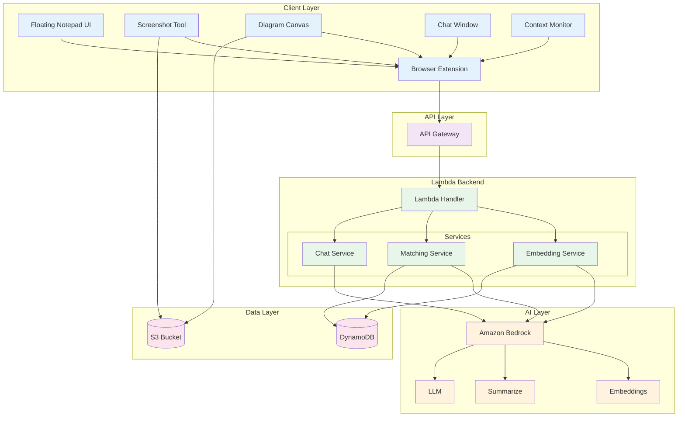

# Design Document: EchoLearn (RecallAI)

## Overview

EchoLearn is an AI-powered browser extension that transforms passive note-taking into an active learning companion through semantic understanding and contextual retrieval. The system consists of a floating notepad interface, AWS-powered AI processing for semantic embeddings, and intelligent note retrieval based on webpage content analysis.

**Architecture Philosophy:** This design follows an MVP-first approach optimized for hackathon demonstration. The architecture uses a simplified AWS stack (6 core services) that can be extended post-hackathon without changing the product design. Vector embeddings are stored directly in DynamoDB, which is acceptable for MVP scale (hundreds/thousands of notes) and avoids the complexity of dedicated vector databases.

## Architecture

### High-Level Architecture

```
Browser Extension
       |
   API Gateway
       |
    Lambda
   /   |    \
Bedrock DynamoDB  S3
```

**Core Components:**
- **Browser Extension**: React-based UI with floating notepad, screenshot tool, diagram canvas, and chat interface
- **API Gateway**: RESTful API endpoints for note operations and context matching
- **AWS Lambda**: Serverless compute for AI processing, embedding generation, and similarity matching
- **Amazon Bedrock**: AI service for embeddings generation, summarization, and chat responses
- **DynamoDB**: NoSQL database storing notes, metadata, and embedding vectors
- **S3**: Object storage for screenshots and diagram images
- **Cognito (Optional)**: User authentication and authorization

### Simplified Architecture Diagram



### Component Interaction Flow

**Note Creation Flow:**
1. User writes/pastes content in extension
2. Extension → POST /notes to API Gateway
3. Lambda → Bedrock (generate embedding)
4. Lambda → DynamoDB (store text + embedding vector + metadata)
5. Lambda → Response with note ID

**Context Matching Flow:**
1. Extension monitors page content changes
2. Extension → POST /match with page text
3. Lambda → Bedrock (generate page embedding)
4. Lambda → DynamoDB (fetch all user notes)
5. Lambda → Compute cosine similarity in-memory
6. Lambda → Return top 3-5 matches
7. Extension displays relevant notes

**Screenshot/Diagram Flow:**
1. User captures screenshot or creates diagram
2. Extension → POST /media with image data
3. Lambda → S3 (store image)
4. Lambda → DynamoDB (store metadata + S3 URL)
5. Lambda → Response with media ID

**Chat Flow:**
1. User asks question in chat
2. Extension → POST /chat with message + context
3. Lambda → Fetch relevant notes from DynamoDB
4. Lambda → Bedrock LLM (generate response with context)
5. Lambda → Response with AI answer

## Components and Interfaces

### 1. Browser Extension (Client Layer)

**Extension Manifest (Manifest V3)**
```json
{
  "manifest_version": 3,
  "name": "EchoLearn",
  "version": "1.0.0",
  "permissions": ["storage", "activeTab", "scripting"],
  "host_permissions": ["<all_urls>"],
  "background": {
    "service_worker": "background.js"
  },
  "content_scripts": [{
    "matches": ["<all_urls>"],
    "js": ["content.js"],
    "css": ["notepad.css"]
  }],
  "action": {
    "default_popup": "popup.html"
  }
}
```

**Content Script (Page Interaction)**
```typescript
interface ContentScript {
  // Page Analysis
  extractPageContent(): PageContent
  observeContentChanges(): void
  
  // UI Integration
  injectFloatingNotepad(): void
  updateNotePadContent(notes: Note[]): void
  
  // API Communication
  sendToBackend(endpoint: string, data: any): Promise<any>
}
```

**Floating Notepad Component**
```typescript
interface FloatingNotepad {
  // UI Management
  show(): void
  hide(): void
  toggle(): void
  resize(width: number, height: number): void
  
  // Content Display
  displayNotes(notes: Note[]): void
  displayRelevantNotes(notes: Note[], relevanceScores: number[]): void
  showEmptyState(): void
  
  // User Interaction
  onNoteCreate(callback: (content: string) => void): void
  onNoteEdit(callback: (noteId: string, content: string) => void): void
  onNoteDelete(callback: (noteId: string) => void): void
  onScreenshot(callback: (imageData: string) => void): void
  onDiagramCreate(callback: (diagramData: string) => void): void
  
  // UI State
  setLoadingState(isLoading: boolean): void
  showError(error: string): void
  updateRelevanceIndicators(scores: number[]): void
}
```

**Chat Assistant Interface**
```typescript
interface ChatAssistant {
  // Chat Management
  startChat(): void
  sendMessage(message: string): Promise<string>
  getChatHistory(): ChatMessage[]
  clearChatHistory(): void
  
  // Context Integration
  setNoteContext(notes: Note[]): void
  setPageContext(content: PageContent): void
}
```

### 2. API Gateway Layer

**REST API Endpoints**

```typescript
// Note Operations
POST   /notes              // Create new note
GET    /notes              // List all notes
GET    /notes/{id}         // Get specific note
PUT    /notes/{id}         // Update note
DELETE /notes/{id}         // Delete note

// Context Matching
POST   /match              // Find relevant notes for current page

// Media Operations
POST   /media              // Upload screenshot/diagram
GET    /media/{id}         // Retrieve media

// Chat Operations
POST   /chat               // Send chat message

// User Operations (Optional - if using Cognito)
POST   /auth/signup        // User registration
POST   /auth/login         // User login
POST   /auth/refresh       // Refresh token
```

**API Request/Response Models**
```typescript
// Create Note Request
interface CreateNoteRequest {
  content: string
  title?: string
  tags?: string[]
  sourceUrl?: string
  sourceTitle?: string
}

// Create Note Response
interface CreateNoteResponse {
  noteId: string
  embedding: number[]
  summary: string
  topics: string[]
  createdAt: string
}

// Match Request
interface MatchRequest {
  pageContent: string
  pageUrl: string
  pageTitle: string
  maxResults?: number
  threshold?: number
}

// Match Response
interface MatchResponse {
  matches: Array<{
    note: Note
    similarity: number
    relevanceScore: number
  }>
  processingTime: number
}

// Chat Request
interface ChatRequest {
  message: string
  pageContext?: PageContent
  noteContext?: string[]
}

// Chat Response
interface ChatResponse {
  response: string
  conversationId: string
}
```

### 3. Lambda Backend Services

**Lambda Handler (Main Entry Point)**
```typescript
interface LambdaHandler {
  // Route handling
  handleRequest(event: APIGatewayEvent): Promise<APIGatewayResponse>
  
  // Service delegation
  routeToService(path: string, method: string, body: any): Promise<any>
}
```

**Embedding Service**
```typescript
interface EmbeddingService {
  // Bedrock Integration
  generateEmbedding(text: string): Promise<number[]>
  batchGenerateEmbeddings(texts: string[]): Promise<number[][]>
  
  // Text Processing
  cleanAndNormalizeText(text: string): string
  chunkLongContent(text: string, maxTokens: number): string[]
  
  // Bedrock Configuration
  getBedrockClient(): BedrockClient
  setEmbeddingModel(modelId: string): void
}
```

**Matching Service**
```typescript
interface MatchingService {
  // Similarity Computation
  findSimilarNotes(
    queryEmbedding: number[],
    userId: string,
    options: SearchOptions
  ): Promise<SearchResult[]>
  
  // Cosine Similarity
  cosineSimilarity(vec1: number[], vec2: number[]): number
  
  // Ranking
  rankResults(results: SearchResult[]): SearchResult[]
  
  // DynamoDB Integration
  fetchUserNotes(userId: string): Promise<Note[]>
}
```

**Chat Service**
```typescript
interface ChatService {
  // LLM Integration
  generateResponse(
    message: string,
    context: ChatContext
  ): Promise<string>
  
  // Context Management
  buildContextPrompt(
    message: string,
    notes: Note[],
    pageContent?: PageContent
  ): string
  
  // Bedrock LLM
  callBedrockLLM(prompt: string): Promise<string>
}
```

### 4. Amazon Bedrock Integration

**Bedrock Client Configuration**
```typescript
interface BedrockConfig {
  region: string
  embeddingModel: string  // e.g., "amazon.titan-embed-text-v1"
  llmModel: string        // e.g., "anthropic.claude-v2"
  maxTokens: number
  temperature: number
}

interface BedrockService {
  // Embeddings
  invokeEmbeddingModel(text: string): Promise<number[]>
  
  // Text Generation
  invokeLLM(prompt: string, config: LLMConfig): Promise<string>
  
  // Summarization
  summarizeText(text: string): Promise<string>
  
  // Error Handling
  handleBedrockError(error: BedrockError): void
}
```

### 5. Data Storage Components

**DynamoDB Schema**

**Notes Table**
```typescript
interface NotesTable {
  // Primary Key
  PK: string              // "USER#{userId}"
  SK: string              // "NOTE#{noteId}"
  
  // Attributes
  noteId: string
  userId: string
  content: string
  title?: string
  summary: string
  embedding: number[]     // Stored as List of Numbers
  tags: string[]
  topics: string[]
  sourceUrl?: string
  sourceTitle?: string
  mediaUrls?: string[]
  createdAt: string
  updatedAt: string
  
  // GSI for querying
  GSI1PK: string         // "USER#{userId}"
  GSI1SK: string         // "CREATED#{timestamp}"
}
```

**Media Table**
```typescript
interface MediaTable {
  // Primary Key
  PK: string              // "USER#{userId}"
  SK: string              // "MEDIA#{mediaId}"
  
  // Attributes
  mediaId: string
  userId: string
  noteId?: string
  mediaType: "screenshot" | "diagram"
  s3Bucket: string
  s3Key: string
  s3Url: string
  createdAt: string
}
```

**DynamoDB Service**
```typescript
interface DynamoDBService {
  // Note Operations
  createNote(note: Note, embedding: number[]): Promise<string>
  getNote(userId: string, noteId: string): Promise<Note | null>
  updateNote(userId: string, noteId: string, updates: Partial<Note>): Promise<void>
  deleteNote(userId: string, noteId: string): Promise<void>
  listUserNotes(userId: string): Promise<Note[]>
  
  // Query Operations
  queryNotesByDate(userId: string, startDate: string, endDate: string): Promise<Note[]>
  queryNotesByTags(userId: string, tags: string[]): Promise<Note[]>
  
  // Media Operations
  createMedia(media: Media): Promise<string>
  getMedia(userId: string, mediaId: string): Promise<Media | null>
}
```

**S3 Service**
```typescript
interface S3Service {
  // Upload Operations
  uploadScreenshot(userId: string, imageData: Buffer): Promise<string>
  uploadDiagram(userId: string, diagramData: Buffer): Promise<string>
  
  // Retrieval Operations
  getMediaUrl(s3Key: string): Promise<string>
  getSignedUrl(s3Key: string, expiresIn: number): Promise<string>
  
  // Management
  deleteMedia(s3Key: string): Promise<void>
  listUserMedia(userId: string): Promise<string[]>
}
```

### 6. Authentication (Optional - Cognito)

**Cognito Integration**
```typescript
interface CognitoService {
  // User Management
  signUp(email: string, password: string): Promise<CognitoUser>
  confirmSignUp(email: string, code: string): Promise<void>
  signIn(email: string, password: string): Promise<AuthTokens>
  
  // Token Management
  refreshToken(refreshToken: string): Promise<AuthTokens>
  validateToken(accessToken: string): Promise<TokenPayload>
  
  // User Info
  getUserId(accessToken: string): Promise<string>
}

interface AuthTokens {
  accessToken: string
  idToken: string
  refreshToken: string
  expiresIn: number
}
```

## Data Models

### Core Data Structures

**Note Model**
```typescript
interface Note {
  noteId: string
  userId: string
  content: string
  title?: string
  summary: string
  embedding: number[]
  tags: string[]
  topics: string[]
  sourceUrl?: string
  sourceTitle?: string
  mediaUrls?: string[]
  createdAt: string
  updatedAt: string
}
```

**Page Content Model**
```typescript
interface PageContent {
  url: string
  title: string
  mainContent: string
  headings: string[]
  metadata: PageMetadata
}

interface PageMetadata {
  domain: string
  description?: string
  keywords: string[]
  language: string
}
```

**Search Models**
```typescript
interface SearchResult {
  note: Note
  similarity: number
  relevanceScore: number
}

interface SearchOptions {
  threshold: number
  maxResults: number
  filterByTags?: string[]
}
```

**Chat Models**
```typescript
interface ChatMessage {
  id: string
  content: string
  role: 'user' | 'assistant'
  timestamp: string
}

interface ChatContext {
  currentPage?: PageContent
  relevantNotes: Note[]
  conversationHistory: ChatMessage[]
}
```

**Media Model**
```typescript
interface Media {
  mediaId: string
  userId: string
  noteId?: string
  mediaType: 'screenshot' | 'diagram'
  s3Bucket: string
  s3Key: string
  s3Url: string
  createdAt: string
}
```

## Error Handling

### Error Categories and Strategies

**AWS Service Errors**
- Bedrock throttling: Exponential backoff with retry
- Bedrock model errors: Fallback to alternative models
- DynamoDB throttling: Batch write with retry logic
- S3 upload failures: Retry with exponential backoff
- API Gateway timeout: Client-side retry with user notification

**Extension Errors**
- API connection failures: Queue operations for retry when online
- Content extraction errors: Graceful degradation with partial content
- UI injection conflicts: Namespace isolation and conflict detection
- Browser compatibility: Feature detection and polyfills

**Data Errors**
- Invalid embedding format: Validation and error logging
- Missing required fields: Default value assignment
- Data corruption: Backup restoration mechanisms
- Storage quota exceeded: User notification with cleanup options

**User-Facing Errors**
- Network connectivity issues: Offline mode with sync queue
- Authentication failures: Token refresh with re-login prompt
- Permission denied: Clear error messages with resolution steps
- Rate limiting: User notification with retry timing

### Error Recovery Mechanisms

```typescript
interface ErrorHandler {
  // Error Classification
  classifyError(error: Error): ErrorType
  shouldRetry(error: Error, attemptCount: number): boolean
  
  // Recovery Strategies
  handleAWSError(error: AWSError): Promise<void>
  handleNetworkError(error: NetworkError): Promise<void>
  handleStorageError(error: StorageError): Promise<void>
  
  // User Communication
  notifyUser(error: UserFacingError): void
  suggestRecoveryActions(error: Error): RecoveryAction[]
  
  // Logging
  logError(error: Error, context: ErrorContext): void
}
```

## Testing Strategy

### Dual Testing Approach

The testing strategy combines unit tests for specific functionality with property-based tests for universal correctness properties. This ensures both concrete bug detection and comprehensive input coverage.

**Unit Testing Focus:**
- API endpoint integration and request/response validation
- AWS service integration (Bedrock, DynamoDB, S3)
- Error handling and edge cases
- Browser extension lifecycle and UI interactions
- Specific examples that demonstrate correct behavior

**Property-Based Testing Focus:**
- Universal properties that hold across all inputs
- Semantic consistency and embedding quality
- Search result relevance and ranking accuracy
- Data integrity and storage consistency
- Performance characteristics under load

**Testing Configuration:**
- Property tests: Minimum 100 iterations per test using fast-check library
- Unit tests: Jest framework for Lambda functions, React Testing Library for extension UI
- Integration tests: Postman/Newman for API testing, Puppeteer for extension E2E
- Performance tests: Artillery for load testing API endpoints

**Test Environment Setup:**
- Mock AWS services using aws-sdk-mock or LocalStack
- Mock Bedrock responses for consistent test performance
- Test DynamoDB using DynamoDB Local
- Mock S3 using s3rver or MinIO
- Extension testing using chrome-extension-mock

**AWS-Specific Testing:**
- Lambda function unit tests with mocked AWS SDK
- DynamoDB integration tests with local instance
- S3 upload/download tests with mock bucket
- API Gateway integration tests with SAM Local
- Bedrock mock responses for embedding and LLM calls

## Correctness Properties

*A property is a characteristic or behavior that should hold true across all valid executions of a system—essentially, a formal statement about what the system should do. Properties serve as the bridge between human-readable specifications and machine-verifiable correctness guarantees.*

Based on the requirements analysis, the following properties ensure EchoLearn's correctness across all valid inputs and usage scenarios:

### Property 1: Note Storage Round-Trip Consistency
*For any* valid note content, storing the note via API and then retrieving it should return the original content along with generated metadata (ID, timestamp, embeddings, summary)
**Validates: Requirements 2.2, 2.3, 2.4**

### Property 2: Embedding Generation Consistency
*For any* text content, generating embeddings through Bedrock should produce consistent vector representations with the same dimensionality
**Validates: Requirements 2.1, 2.5, 10.1**

### Property 3: Semantic Similarity Accuracy
*For any* semantically similar text content (regardless of phrasing), the cosine similarity between their embeddings should be ≥ 0.7
**Validates: Requirements 10.1, 10.4, 10.5**

### Property 4: Context-Aware Retrieval Ranking
*For any* webpage content, the matching API should return notes ranked by similarity score in descending order, with all results above the configured threshold
**Validates: Requirements 3.1, 3.2, 3.3, 3.4**

### Property 5: API Response Time Compliance
*For any* API request, the response time should meet specified limits (note creation < 3s, matching < 2s, chat < 5s)
**Validates: Requirements 6.1, 6.2, 6.3**

### Property 6: CRUD Operations Integrity
*For any* stored note, all CRUD operations (create, read, update, delete) via API should maintain data integrity and update metadata appropriately
**Validates: Requirements 9.1, 9.3, 9.4**

### Property 7: Media Storage Consistency
*For any* uploaded screenshot or diagram, the media should be stored in S3 with metadata in DynamoDB, and retrieval should return the original content
**Validates: Requirements 2.4, 9.5**

### Property 8: Cross-Domain Functionality
*For any* HTTP/HTTPS website, the extension should successfully extract content and communicate with the backend API
**Validates: Requirements 5.1, 5.2, 5.5**

### Property 9: Chat Context Integration
*For any* chat request, the response should incorporate relevant notes and page context when provided
**Validates: Requirements 4.3, 4.4, 4.5**

### Property 10: Data Export/Import Consistency
*For any* collection of stored notes, exporting data from DynamoDB and re-importing should preserve all note content, embeddings, and metadata
**Validates: Requirements 9.5**

### Property 11: Error Recovery Resilience
*For any* transient AWS service error (throttling, timeout), the system should retry with exponential backoff and eventually succeed or provide clear error messaging
**Validates: Requirements 6.4, 7.2**

### Property 12: Authentication Token Validity
*For any* authenticated request (if using Cognito), the system should validate tokens and refresh expired tokens automatically
**Validates: Requirements 7.1, 7.2, 7.3**

**Test Configuration Requirements:**
- Each property test must run minimum 100 iterations using fast-check library
- Property tests must be tagged with format: **Feature: echolearn, Property {number}: {property_text}**
- Tests must generate diverse input data including edge cases (empty content, large content, special characters, code snippets)
- Performance properties must include load testing with realistic data volumes
- AWS service mocks must simulate realistic latency and error conditions


## Deployment Architecture

### AWS Infrastructure Setup

**Infrastructure as Code (IaC)**
- Use AWS SAM (Serverless Application Model) or Terraform for infrastructure provisioning
- Version control all infrastructure code
- Separate environments: dev, staging, production

**Lambda Configuration**
```yaml
Runtime: Node.js 18.x
Memory: 1024 MB (adjustable based on embedding model size)
Timeout: 30 seconds
Environment Variables:
  - BEDROCK_REGION
  - DYNAMODB_TABLE_NAME
  - S3_BUCKET_NAME
  - EMBEDDING_MODEL_ID
  - LLM_MODEL_ID
```

**DynamoDB Configuration**
```yaml
Billing Mode: On-Demand (pay per request)
Encryption: AWS managed keys
Point-in-time Recovery: Enabled
Global Secondary Indexes:
  - GSI1: userId + createdAt (for time-based queries)
```

**S3 Configuration**
```yaml
Bucket: echolearn-media-{environment}
Versioning: Enabled
Encryption: AES-256
Lifecycle Policy: Archive to Glacier after 90 days
CORS: Enabled for extension access
```

**API Gateway Configuration**
```yaml
Type: REST API
Stage: v1
Throttling: 10,000 requests per second
CORS: Enabled for extension origin
Authorization: Cognito (optional) or API Key
```

### Deployment Pipeline

**CI/CD Workflow**
1. Code commit to GitHub
2. Run unit tests and linting
3. Build Lambda deployment packages
4. Deploy to dev environment
5. Run integration tests
6. Manual approval for production
7. Deploy to production
8. Run smoke tests

**Extension Deployment**
1. Build extension bundle (webpack)
2. Generate manifest.json with correct API endpoints
3. Package as .zip for Chrome Web Store
4. Submit for review
5. Publish to store

### Monitoring and Observability

**CloudWatch Metrics**
- Lambda invocation count, duration, errors
- API Gateway request count, latency, 4xx/5xx errors
- DynamoDB read/write capacity, throttles
- Bedrock API calls, latency, errors

**CloudWatch Logs**
- Lambda function logs with structured logging
- API Gateway access logs
- Error tracking and alerting

**Alarms**
- Lambda error rate > 5%
- API Gateway latency > 3 seconds
- DynamoDB throttling events
- S3 upload failures

### Cost Optimization

**Estimated Monthly Costs (1000 active users)**
- Lambda: ~$20 (1M requests, 1GB memory)
- API Gateway: ~$3.50 (1M requests)
- DynamoDB: ~$25 (on-demand, 10M reads, 1M writes)
- S3: ~$5 (10GB storage, 100K requests)
- Bedrock: ~$50 (embeddings + LLM calls)
- **Total: ~$103.50/month**

**Cost Optimization Strategies**
- Use Lambda reserved concurrency for predictable workloads
- Implement caching for frequently accessed notes
- Batch embedding generation requests
- Use S3 Intelligent-Tiering for media storage
- Monitor and optimize Bedrock token usage

## Security Considerations

### Data Security
- All data encrypted at rest (DynamoDB, S3)
- All data encrypted in transit (HTTPS/TLS)
- Bedrock API calls use AWS IAM authentication
- No sensitive data logged in CloudWatch

### Access Control
- Lambda functions use least-privilege IAM roles
- API Gateway uses Cognito authorizer (optional)
- S3 bucket policies restrict public access
- DynamoDB uses fine-grained access control

### Extension Security
- Content Security Policy (CSP) in manifest
- No eval() or inline scripts
- Sanitize all user input before display
- Validate all API responses
- Use HTTPS for all API calls

### Compliance
- GDPR: User data deletion on request
- Data residency: Deploy in user's region
- Privacy policy: Clear data usage disclosure
- Terms of service: User agreement required

## Scalability Considerations

### Horizontal Scaling
- Lambda auto-scales based on request volume
- DynamoDB on-demand scales automatically
- S3 scales infinitely
- API Gateway handles high throughput

### Performance Optimization
- Cache embeddings in extension local storage
- Batch API requests where possible
- Use DynamoDB batch operations
- Implement pagination for large result sets
- Use CloudFront CDN for static assets

### Future Enhancements (Post-Hackathon)

**Vector Database Migration**
- Migrate from DynamoDB to OpenSearch or Pinecone
- Improves similarity search performance
- Enables advanced filtering and faceting
- Architecture designed for easy swap

**Advanced Features**
- Flowchart/diagram drawing canvas
- Spaced repetition algorithm
- Quiz generation from notes
- Pomodoro timer integration
- Team collaboration features
- Mobile app (React Native)

**AI Enhancements**
- Fine-tuned embedding models for domain-specific content
- Multi-modal embeddings (text + images)
- Automatic note summarization
- Smart tagging and categorization
- Personalized learning recommendations

## Development Roadmap

### Phase 1: MVP (Hackathon - 2 days)
- [ ] Browser extension UI (floating notepad)
- [ ] Basic note creation and storage
- [ ] AWS Lambda backend setup
- [ ] Bedrock integration for embeddings
- [ ] DynamoDB schema and operations
- [ ] Context matching API
- [ ] Basic chat assistant

### Phase 2: Core Features (Week 1-2)
- [ ] Screenshot capture and storage
- [ ] Diagram canvas (basic)
- [ ] Note editing and deletion
- [ ] Search functionality
- [ ] Tag management
- [ ] UI polish and responsive design

### Phase 3: Advanced Features (Week 3-4)
- [ ] User authentication (Cognito)
- [ ] Multi-device sync
- [ ] Export/import functionality
- [ ] Advanced chat features
- [ ] Performance optimization
- [ ] Error handling improvements

### Phase 4: Production Ready (Week 5-6)
- [ ] Comprehensive testing
- [ ] Security audit
- [ ] Documentation
- [ ] Chrome Web Store submission
- [ ] Marketing materials
- [ ] User onboarding flow

## Technical Decisions and Rationale

### Why AWS Over Local Processing?
- **Scalability**: Cloud scales better than browser-based models
- **Performance**: Bedrock models are more powerful than browser-compatible models
- **Reliability**: AWS infrastructure is more reliable than client-side processing
- **Features**: Easier to add advanced AI features (summarization, chat)
- **Trade-off**: Requires internet connection, but acceptable for MVP

### Why DynamoDB Over OpenSearch for MVP?
- **Simplicity**: Easier to set up and manage
- **Cost**: Lower cost for small scale
- **Speed**: Fast enough for hackathon demo
- **Flexibility**: Can migrate to OpenSearch later without product changes
- **Trade-off**: Slower similarity search, but acceptable for MVP scale

### Why Bedrock Over OpenAI?
- **Integration**: Native AWS service, easier IAM and networking
- **Cost**: Competitive pricing with AWS credits
- **Compliance**: Data stays in AWS ecosystem
- **Models**: Access to multiple model providers (Anthropic, Amazon)
- **Trade-off**: Slightly less mature than OpenAI, but sufficient for MVP

### Why React for Extension?
- **Productivity**: Faster development with component reusability
- **Ecosystem**: Rich library ecosystem for UI components
- **State Management**: Easy state management with hooks
- **Testing**: Good testing tools and practices
- **Trade-off**: Larger bundle size, but acceptable with webpack optimization
