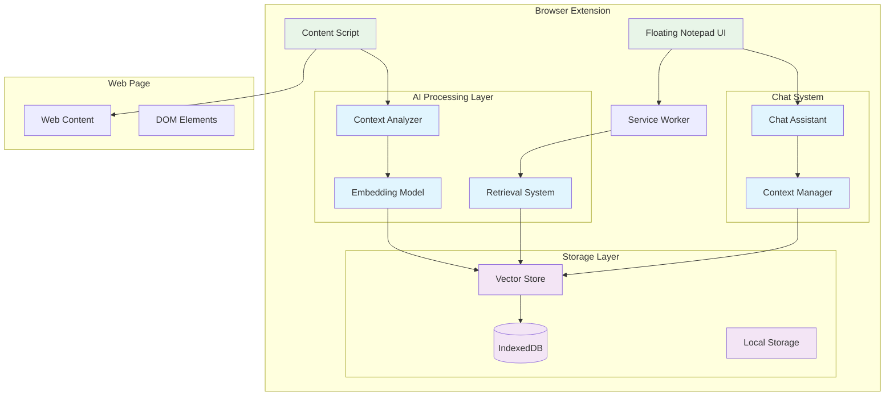

# Design Document: EchoLearn (RecallAI)

## Overview

EchoLearn is a browser extension that transforms passive note-taking into an active learning companion through AI-powered semantic understanding and contextual retrieval. The system consists of a floating notepad interface, local AI processing for semantic embeddings, and intelligent note retrieval based on webpage content analysis.

The architecture prioritizes privacy by keeping all processing local to the browser, using Transformers.js for embedding generation and IndexedDB for vector storage. This approach eliminates external API dependencies while providing fast, offline-capable semantic search.

## Architecture

### High-Level Architecture



### Component Interaction Flow

1. **Content Analysis**: Content script analyzes webpage content and sends to service worker
2. **Embedding Generation**: Service worker uses Transformers.js to generate embeddings
3. **Similarity Search**: Vector store performs cosine similarity search against stored notes
4. **Result Display**: Relevant notes are displayed in the floating notepad interface
5. **Note Creation**: New notes are processed through the same embedding pipeline

## Components and Interfaces

### 1. Extension Infrastructure

**Manifest Configuration (Manifest V3)**
- Service worker for background processing and AI inference
- Content scripts for webpage interaction and DOM manipulation
- Permissions for storage, activeTab, and scripting
- Cross-origin permissions for AI model loading

**Service Worker (Background Processing)**
```typescript
interface ServiceWorker {
  // AI Processing
  generateEmbedding(text: string): Promise<Float32Array>
  analyzePageContent(content: PageContent): Promise<EmbeddingResult>
  
  // Note Management
  storeNote(note: Note): Promise<string>
  searchSimilarNotes(embedding: Float32Array, threshold: number): Promise<Note[]>
  
  // Message Handling
  handleContentScriptMessage(message: ExtensionMessage): Promise<void>
  handlePopupMessage(message: ExtensionMessage): Promise<void>
}
```

**Content Script (Page Interaction)**
```typescript
interface ContentScript {
  // Page Analysis
  extractPageContent(): PageContent
  observeContentChanges(): void
  
  // UI Integration
  injectFloatingNotepad(): void
  updateNotePadContent(notes: Note[]): void
  
  // Communication
  sendToServiceWorker(message: ExtensionMessage): Promise<void>
}
```

### 2. AI Processing Components

**Embedding Model (Transformers.js Integration)**
```typescript
interface EmbeddingModel {
  // Model Management
  loadModel(modelName: string): Promise<void>
  isModelLoaded(): boolean
  
  // Embedding Generation
  encode(text: string): Promise<Float32Array>
  batchEncode(texts: string[]): Promise<Float32Array[]>
  
  // Model Configuration
  getModelInfo(): ModelInfo
  setModelOptions(options: ModelOptions): void
}
```

**Context Analyzer**
```typescript
interface ContextAnalyzer {
  // Content Processing
  extractMainContent(html: string): string
  cleanAndNormalizeText(text: string): string
  chunkLongContent(text: string, maxLength: number): string[]
  
  // Semantic Analysis
  generateContentEmbedding(content: PageContent): Promise<Float32Array>
  extractKeyTopics(text: string): string[]
  
  // Content Classification
  classifyContentType(content: PageContent): ContentType
  assessContentRelevance(content: PageContent): number
}
```

**Retrieval System**
```typescript
interface RetrievalSystem {
  // Similarity Search
  findSimilarNotes(queryEmbedding: Float32Array, options: SearchOptions): Promise<SearchResult[]>
  rankResults(results: SearchResult[], context: SearchContext): SearchResult[]
  
  // Search Configuration
  setSearchThreshold(threshold: number): void
  setMaxResults(maxResults: number): void
  
  // Search Analytics
  getSearchMetrics(): SearchMetrics
  logSearchQuery(query: SearchQuery): void
}
```

### 3. Storage Components

**Vector Store (IndexedDB Integration)**
```typescript
interface VectorStore {
  // Note Storage
  storeNote(note: Note, embedding: Float32Array): Promise<string>
  updateNote(noteId: string, note: Note, embedding?: Float32Array): Promise<void>
  deleteNote(noteId: string): Promise<void>
  
  // Vector Operations
  searchByVector(queryVector: Float32Array, k: number): Promise<SearchResult[]>
  calculateSimilarity(vector1: Float32Array, vector2: Float32Array): number
  
  // Database Management
  initializeDatabase(): Promise<void>
  exportData(): Promise<ExportData>
  importData(data: ExportData): Promise<void>
  clearAllData(): Promise<void>
}
```

**Local Storage Manager**
```typescript
interface LocalStorageManager {
  // Configuration Storage
  saveUserPreferences(preferences: UserPreferences): Promise<void>
  loadUserPreferences(): Promise<UserPreferences>
  
  // Cache Management
  cacheModelData(modelId: string, data: ArrayBuffer): Promise<void>
  getCachedModelData(modelId: string): Promise<ArrayBuffer | null>
  
  // Storage Utilities
  getStorageUsage(): Promise<StorageUsage>
  cleanupOldData(retentionDays: number): Promise<void>
}
```

### 4. User Interface Components

**Floating Notepad**
```typescript
interface FloatingNotepad {
  // UI Management
  show(): void
  hide(): void
  toggle(): void
  resize(width: number, height: number): void
  
  // Content Display
  displayNotes(notes: Note[]): void
  displayRelevantNotes(notes: Note[], relevanceScores: number[]): void
  showEmptyState(): void
  
  // User Interaction
  onNoteCreate(callback: (content: string) => void): void
  onNoteEdit(callback: (noteId: string, content: string) => void): void
  onNoteDelete(callback: (noteId: string) => void): void
  
  // UI State
  setLoadingState(isLoading: boolean): void
  showError(error: string): void
  updateRelevanceIndicators(scores: number[]): void
}
```

**Chat Assistant Interface**
```typescript
interface ChatAssistant {
  // Chat Management
  startChat(): void
  sendMessage(message: string): Promise<string>
  getChatHistory(): ChatMessage[]
  clearChatHistory(): void
  
  // Context Integration
  setNoteContext(notes: Note[]): void
  setPageContext(content: PageContent): void
  
  // AI Integration
  generateResponse(message: string, context: ChatContext): Promise<string>
  suggestQuestions(notes: Note[]): string[]
}
```

## Data Models

### Core Data Structures

**Note Model**
```typescript
interface Note {
  id: string
  content: string
  title?: string
  createdAt: Date
  updatedAt: Date
  tags: string[]
  sourceUrl?: string
  sourceTitle?: string
  metadata: NoteMetadata
}

interface NoteMetadata {
  contentType: 'text' | 'code' | 'quote' | 'list'
  language?: string
  wordCount: number
  readingTime: number
  extractedTopics: string[]
}
```

**Page Content Model**
```typescript
interface PageContent {
  url: string
  title: string
  mainContent: string
  headings: string[]
  metadata: PageMetadata
  extractedText: string
  contentType: ContentType
}

interface PageMetadata {
  domain: string
  publishDate?: Date
  author?: string
  description?: string
  keywords: string[]
  language: string
}

type ContentType = 'article' | 'documentation' | 'research' | 'tutorial' | 'reference' | 'other'
```

**Embedding and Search Models**
```typescript
interface EmbeddingResult {
  noteId: string
  embedding: Float32Array
  processingTime: number
  modelVersion: string
}

interface SearchResult {
  note: Note
  similarity: number
  relevanceScore: number
  matchedTopics: string[]
}

interface SearchOptions {
  threshold: number
  maxResults: number
  includeMetadata: boolean
  filterByTags?: string[]
  filterByDate?: DateRange
}
```

**Chat and Context Models**
```typescript
interface ChatMessage {
  id: string
  content: string
  role: 'user' | 'assistant'
  timestamp: Date
  context?: ChatContext
}

interface ChatContext {
  currentPage: PageContent
  relevantNotes: Note[]
  searchQuery?: string
  conversationHistory: ChatMessage[]
}
```

### Database Schema (IndexedDB)

**Notes Store**
- Primary Key: `id` (string)
- Indexes: `createdAt`, `updatedAt`, `tags`, `sourceUrl`
- Data: Note object + metadata

**Embeddings Store**
- Primary Key: `noteId` (string, foreign key to Notes)
- Data: Float32Array embedding + metadata
- Indexes: None (vector similarity search handled in memory)

**User Preferences Store**
- Primary Key: `key` (string)
- Data: JSON serialized preferences
- Indexes: None

**Cache Store**
- Primary Key: `cacheKey` (string)
- Data: Cached model data, search results
- Indexes: `expiresAt` for cleanup
- TTL: Configurable per cache type

## Error Handling

### Error Categories and Strategies

**AI Processing Errors**
- Model loading failures: Graceful degradation to keyword-based search
- Embedding generation errors: Retry with exponential backoff
- Memory constraints: Chunk processing and batch size reduction
- Model compatibility issues: Fallback to alternative models

**Storage Errors**
- IndexedDB quota exceeded: User notification with cleanup options
- Database corruption: Automatic backup restoration
- Network storage sync failures: Queue for retry when online
- Data migration errors: Version-specific migration handlers

**Browser Compatibility Errors**
- Manifest V3 compatibility: Feature detection and polyfills
- WebAssembly support: Fallback to JavaScript-only processing
- IndexedDB availability: Fallback to localStorage with limitations
- Content Security Policy violations: Dynamic permission requests

**User Interface Errors**
- Extension injection failures: Retry with different injection strategies
- DOM manipulation conflicts: Namespace isolation and conflict detection
- Responsive design issues: Adaptive layout with viewport detection
- Performance degradation: Automatic feature throttling

### Error Recovery Mechanisms

```typescript
interface ErrorHandler {
  // Error Classification
  classifyError(error: Error): ErrorType
  shouldRetry(error: Error, attemptCount: number): boolean
  
  // Recovery Strategies
  handleModelLoadError(error: ModelError): Promise<void>
  handleStorageError(error: StorageError): Promise<void>
  handleNetworkError(error: NetworkError): Promise<void>
  
  // User Communication
  notifyUser(error: UserFacingError): void
  suggestRecoveryActions(error: Error): RecoveryAction[]
  
  // Logging and Analytics
  logError(error: Error, context: ErrorContext): void
  reportCriticalError(error: CriticalError): void
}
```

## Testing Strategy

### Dual Testing Approach

The testing strategy combines unit tests for specific functionality with property-based tests for universal correctness properties. This ensures both concrete bug detection and comprehensive input coverage.

**Unit Testing Focus:**
- Component integration points and API boundaries
- Error handling and edge cases
- Browser compatibility and extension lifecycle
- User interface interactions and state management
- Specific examples that demonstrate correct behavior

**Property-Based Testing Focus:**
- Universal properties that hold across all inputs
- Semantic consistency and embedding quality
- Search result relevance and ranking accuracy
- Data integrity and storage consistency
- Performance characteristics under load

**Testing Configuration:**
- Property tests: Minimum 100 iterations per test using fast-check library
- Unit tests: Jest framework with browser environment simulation
- Integration tests: Puppeteer for end-to-end extension testing
- Performance tests: Benchmark.js for AI processing and search operations

**Test Environment Setup:**
- Mock browser extension APIs using chrome-extension-mock
- Simulate IndexedDB using fake-indexeddb
- Mock Transformers.js models for consistent test performance
- Test data generators for notes, embeddings, and page content

## Correctness Properties

*A property is a characteristic or behavior that should hold true across all valid executions of a system—essentially, a formal statement about what the system should do. Properties serve as the bridge between human-readable specifications and machine-verifiable correctness guarantees.*

Based on the requirements analysis, the following properties ensure EchoLearn's correctness across all valid inputs and usage scenarios:

### Property 1: Note Storage Round-Trip Consistency
*For any* valid note content, storing the note and then retrieving it should return the original content along with generated metadata (ID, timestamp, embeddings)
**Validates: Requirements 2.2, 2.3, 2.4**

### Property 2: UI State Persistence
*For any* notepad configuration (size, position, minimized state), the configuration should persist across browser sessions and navigation events
**Validates: Requirements 1.2, 1.3**

### Property 3: Semantic Embedding Consistency
*For any* semantically similar text content (regardless of phrasing), the generated embeddings should have high cosine similarity (≥ 0.7)
**Validates: Requirements 2.1, 2.5, 10.1, 10.4**

### Property 4: Context-Aware Retrieval Accuracy
*For any* webpage content, the retrieval system should return notes ranked by semantic similarity and recency, with similarity scores above the configured threshold
**Validates: Requirements 3.1, 3.2, 3.3, 3.4**

### Property 5: Cross-Domain Functionality
*For any* HTTP/HTTPS website, the extension should maintain full functionality including content analysis, note retrieval, and UI accessibility
**Validates: Requirements 5.1, 5.2, 5.5**

### Property 6: Performance Bounds Compliance
*For any* content processing operation, the system should complete within specified time limits (content analysis < 2s, note retrieval < 1s, page load overhead < 100ms)
**Validates: Requirements 6.1, 6.2, 6.3, 6.4**

### Property 7: Note Management Operations
*For any* stored note, all CRUD operations (create, read, update, delete) should maintain data integrity and update metadata appropriately
**Validates: Requirements 9.1, 9.3, 9.4**

### Property 8: Search Functionality Completeness
*For any* search query across stored notes, the system should return all relevant matches ranked by relevance score using semantic similarity
**Validates: Requirements 9.2, 10.5**

### Property 9: Data Export Consistency
*For any* collection of stored notes, exporting and then importing the data should preserve all note content, metadata, and relationships
**Validates: Requirements 9.5**

### Property 10: Chat Context Integration
*For any* chat session, the assistant should have access to current page context and relevant stored notes for contextually appropriate responses
**Validates: Requirements 4.3, 4.5**

### Property 11: Multi-Language Processing
*For any* text content in supported languages, the AI engine should generate meaningful embeddings and enable cross-language semantic search
**Validates: Requirements 10.3**

### Property 12: Data Encryption Integrity
*For any* stored note or embedding, the data should be encrypted in storage and decryptable to the original content
**Validates: Requirements 7.5**

**Test Configuration Requirements:**
- Each property test must run minimum 100 iterations using fast-check library
- Property tests must be tagged with format: **Feature: echolearn, Property {number}: {property_text}**
- Tests must generate diverse input data including edge cases (empty content, large content, special characters, code snippets)
- Performance properties must include load testing with realistic data volumes
- Cross-browser compatibility testing required for Chrome and Firefox platforms